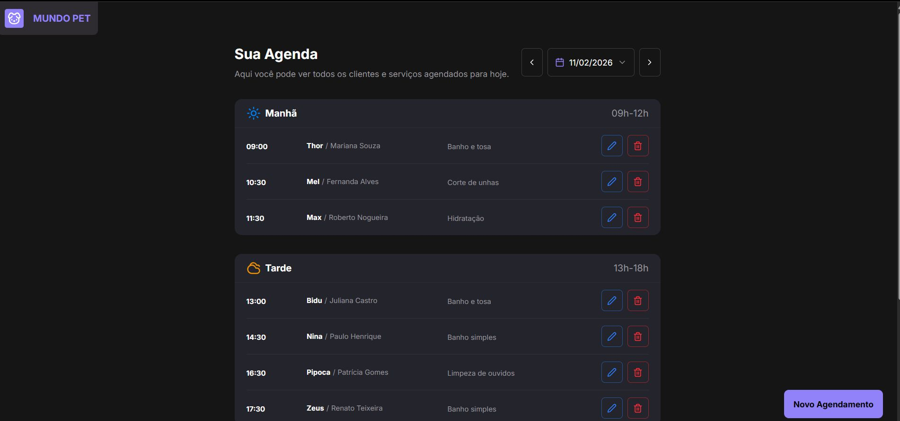

# Projeto Fullstack: Mundo Pet

  </a>

## 💻 Tecnologias

Concluí mais um projeto da Rocketseat, desta vez desenvolvendo uma aplicação fullstack para agendamento de serviços em pet shop utilizando React.js e Next.js.

A aplicação permite que o usuário selecione o dia desejado e realize agendamentos divididos em três períodos:
Manhã: das 9h às 12h
Tarde: das 13h às 18h
Noite: das 19h às 21h

Esse projeto reforçou conceitos importantes de aplicações fullstack modernas com Next.js, integração com banco de dados e gerenciamento de formulários.

## 🛠 Tecnologias

Durante o desenvolvimento, foquei em boas práticas de organização, validação e experiência do usuário, utilizando:

🔹 Next.js + React.js para estrutura fullstack
🔹 shadcn/ui como design system
🔹 Tailwind CSS para estilização
🔹 Zod para validação de formulários
🔹 React Hook Form com inputs controlados
🔹 Form Actions para criar, atualizar e deletar agendamentos
🔹 PostgreSQL rodando em ambiente Docker
🔹 Prisma ORM para comunicação com o banco de dados

## 💛 Contato

vinibrunheroto12@gmail.com
